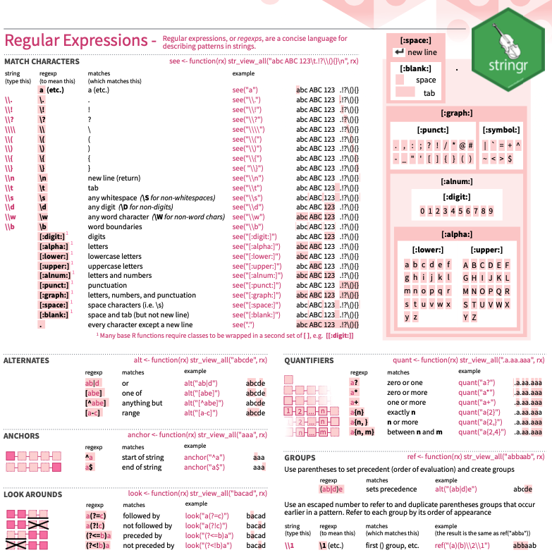

```{r setup, include=FALSE}
options(htmltools.dir.version = FALSE)
knitr::opts_chunk$set(
  fig.width=9, fig.height=3.5, fig.retina=3,
  out.width = "100%",
  cache = FALSE,
  echo = TRUE,
  message = FALSE, 
  warning = FALSE,
  hiline = TRUE
)
```

```{r xaringan-themer, include=FALSE, warning=FALSE}
library(xaringanthemer)
style_duo_accent(
  primary_color = "#34a65d",
  secondary_color = "#51c87c",
  inverse_header_color = "#FFFFFF"
)


library(tidyverse)

# install package
# install.packages("titanic")
library(titanic)
df <- titanic_train
```

class: center, middle


<center></center>


### « Strings are not glamorous, high-profile components of R, but they do play a big role in many data cleaning and preparation tasks. » 
[stringr, tidyverse](https://stringr.tidyverse.org/)

---
background-image: url(https://d33wubrfki0l68.cloudfront.net/45fd04ad9cdb2159fea08d07dbc11e742d68e4e3/df327/css/images/hex/stringr.png)
background-position: 1040px 40px
background-size: 80px

## Chaîne de caractère

Selon GeeksforGeeks 

> Les chaînes de caractères (_string_) sont essentiellement un ensemble de caractères. Un ou plusieurs caractères inclus dans une paire de guillemets simples ou doubles correspondants peuvent être considérés comme une chaîne de caractères dans R. Les chaînes représentent un contenu textuel et peuvent contenir des nombres, des espaces et des caractères spéciaux.  [(Tranduction libre)](https://www.geeksforgeeks.org/r-strings/)

<br /> 

```{r eval=FALSE}

string <- "Voici une chaîne de caractère"
```

<br /> 

```{r eval=FALSE}

string2 <- 'Pour inclure une "citation", on utilise les guillemets simples.'
```

---
background-image: url(https://d33wubrfki0l68.cloudfront.net/45fd04ad9cdb2159fea08d07dbc11e742d68e4e3/df327/css/images/hex/stringr.png)
background-position: 1040px 40px
background-size: 80px

## stringr

#### Un *package* de Tidyverse
Le *package stringr* fournit un ensemble de fonctions pour faciliter le travail avec les chaînes de caractères. Bâti à partir de *stringi*, il offre les fonctions les plus importantes et les plus utilisées pour manipuler les chaînes de caractères.

<br /> 

#### Astuce
Si aucune fonction de *stringr* ne répond à vos besoins, les chances sont que vous trouviez ce que vous cherchez dans *stringi*.


---
background-image: url(https://d33wubrfki0l68.cloudfront.net/45fd04ad9cdb2159fea08d07dbc11e742d68e4e3/df327/css/images/hex/stringr.png)
background-position: 1040px 40px
background-size: 80px

## Des fonctions qui commencent par `str_`

.pull-left[

*   `str_c`
*   `str_conv`
*   `str_count`         
*   `str_detect`      
*   `str_dup`      
*   `str_ends`
*   `str_extract` et `str_extract_all` 
*   `str_flatten`     
*   `str_glue`        
*   `str_glue_data`   
*   `str_interp`      
*   `str_length`     
*   `str_locate` et `str_locate_all`  
*   `str_match` et `str_match_all`   
*   `str_order`       
*   `str_pad`         
*   `str_remove` et `str_remove_all`  
*   `str_replace` et `str_replace_all`
]

.pull-right[

*   `str_replace_na`  
*   `str_sort`        
*   `str_split`       
*   `str_split_fixed`
*   `str_squish`      
*   `str_starts`      
*   `str_sub`         
*   `str_sub<-`       
*   `str_subset`      
*   `str_to_lower` et `str_to_upper`  
*   `str_to_sentence`
*   `str_to_title`    
*   `str_trim`        
*   `str_trunc`       
*   `str_view` et `str_view_all`    
*   `str_which`      
*   `str_wrap`     
]


---
background-image: url(https://d33wubrfki0l68.cloudfront.net/45fd04ad9cdb2159fea08d07dbc11e742d68e4e3/df327/css/images/hex/stringr.png)
background-position: 1040px 40px
background-size: 80px

### Base R contre *stringr*

<br /> 

Bien que R offre un ensemble de fonctions pour travailler avec les chaînes de caractères, on reproche 
à ces fonctions de manquer de cohérence et d'être plus difficiles à apprendre. 

<br /> 

####Pourquoi utiliser *stringr*?

* La structure des fonctions et des arguments est cohérente et consistante. Le premier argument d'une fonction est toujours le vecteur sur lequel on travaille. C'est d'ailleurs ce qui fait que *stringr* est particulièrement adapté pour l'utilisation des pipes (%>%).
* Simplifie les opérations.
* Les résultats des fonctions de *stringr* peuvent facilement être réutilisés. Le package permet notamment de s'assurer que les données manquantes demeurent des données manquantes.

---
class: inverse center middle

# Exploration et nettoyage des données


---
background-image: url(https://d33wubrfki0l68.cloudfront.net/45fd04ad9cdb2159fea08d07dbc11e742d68e4e3/df327/css/images/hex/stringr.png)
background-position: 1040px 40px
background-size: 80px

### Exploration des chaînes de caractères

La fonction `str_length` permet d'évaluer la longueur d'une chaine de caractères.
```{r eval=TRUE}
x <- c("mercure", "vénus", "terre", "mars", "jupiter", "saturne", "uranus", "neptune", NA)

str_length(x)
```

<br /> 

Note : Dans Base R, ce résultat aurait été obtenu avec la fonction `nchar()`.


---
background-image: url(https://d33wubrfki0l68.cloudfront.net/45fd04ad9cdb2159fea08d07dbc11e742d68e4e3/df327/css/images/hex/stringr.png)
background-position: 1040px 40px
background-size: 80px

### Pour gérer les majuscules et les minuscules

*stringr* dispose de quatre fonctions pour nous aider à convertir les majuscules et les minuscules.

<br /> 

La fonction `str_to_upper` pour mettre tous les caractères en majuscule.

```{r eval=TRUE}
x <- c("lEs dOnNéEs pArLeNt d'ElLeS-MêMeS")

str_to_upper(x)

```

---
background-image: url(https://d33wubrfki0l68.cloudfront.net/45fd04ad9cdb2159fea08d07dbc11e742d68e4e3/df327/css/images/hex/stringr.png)
background-position: 1040px 40px
background-size: 80px

### Pour gérer les majuscules et les minuscules

*stringr* dispose de quatre fonctions pour nous aider à convertir les majuscules et les minuscules.

<br /> 

La fonction `str_to_lower` pour mettre tous les caractères en minuscule.

```{r eval=TRUE}
x <- c("lEs dOnNéEs pArLeNt d'ElLeS-MêMeS")

str_to_lower(x)

```

---
background-image: url(https://d33wubrfki0l68.cloudfront.net/45fd04ad9cdb2159fea08d07dbc11e742d68e4e3/df327/css/images/hex/stringr.png)
background-position: 1040px 40px
background-size: 80px

### Pour gérer les majuscules et les minuscules

*stringr* dispose de quatre fonctions pour nous aider à convertir les majuscules et les minuscules.

<br /> 

La fonction `str_to_sentence` pour mettre une majuscule au début de la phrase.

```{r eval=TRUE}
x <- c("vous voyez! lEs dOnNéEs pArLeNt d'ElLeS-MêMeS")

str_to_sentence (x)

```

---
background-image: url(https://d33wubrfki0l68.cloudfront.net/45fd04ad9cdb2159fea08d07dbc11e742d68e4e3/df327/css/images/hex/stringr.png)
background-position: 1040px 40px
background-size: 80px

### Pour gérer les majuscules et les minuscules

*stringr* dispose de quatre fonctions pour nous aider à convertir les majuscules et les minuscules.

<br /> 

La fonction `str_to_title` pour mettre des majuscules dans un titre.

```{r eval=TRUE}
x <- c("lEs dOnNéEs pArLeNt d'ElLeS-MêMeS")

str_to_title(x)
```

---
background-image: url(https://d33wubrfki0l68.cloudfront.net/45fd04ad9cdb2159fea08d07dbc11e742d68e4e3/df327/css/images/hex/stringr.png)
background-position: 1040px 40px
background-size: 80px

### Pour gérer les majuscules et les minuscules

####Astuce
Chaque langue comporte ces propres particularités. Afin de permettre à R d'exécuter correctement les manipulations demandées, l'argument `locale` permet d'indiquer la langue des caractères. Par défaut, les fonctions de *stringr* utilisent "en" pour anglais.

Par exemple, dans l'alphabet hawaïen, le *e* vient avec le *b*.
```{r eval=TRUE}
x <- c("apple", "eggplant", "banana")

str_sort(x, locale = "en")  # En anglais

str_sort(x, locale = "haw") # En hawaïen
```

---
background-image: url(https://d33wubrfki0l68.cloudfront.net/45fd04ad9cdb2159fea08d07dbc11e742d68e4e3/df327/css/images/hex/stringr.png)
background-position: 1040px 40px
background-size: 80px

### Pour extraire ou remplacer des caractères

<br /> 

La fonction `str_sub` pour extraire une partie des caractères. 

Cette fonction est composée de trois arguments, soit le vecteur, la position de départ et la position de fin.

```{r eval=TRUE}
x <- c("mercure", "vénus", "terre", "mars", "jupiter", "saturne", "uranus", "neptune", NA)

# Le 3e caractère
str_sub(x, 3, 3)

# Du 2e caractère à l'avant-dernier caractère
str_sub(x, 2, -2)

```

---
background-image: url(https://d33wubrfki0l68.cloudfront.net/45fd04ad9cdb2159fea08d07dbc11e742d68e4e3/df327/css/images/hex/stringr.png)
background-position: 1040px 40px
background-size: 80px

### Pour extraire ou remplacer des caractères

La fonction `str_sub` peut aussi être utilisée pour modifier un caractère.
```{r eval=TRUE}
x <- c("mercure", "vénus", "terre", "mars", "jupiter", "saturne", "uranus", "neptune", NA)

# Remplacer le troisième caractère par un point d'interrogation
str_sub(x, 3, 3) <- "?"
x
```

---
background-image: url(https://d33wubrfki0l68.cloudfront.net/45fd04ad9cdb2159fea08d07dbc11e742d68e4e3/df327/css/images/hex/stringr.png)
background-position: 1040px 40px
background-size: 80px

### Pour combiner des caractères

La fonction `str_c` permet de combiner des caractères.

```{r eval=TRUE}
str_c("mercure", "vénus", "terre", "mars", "jupiter", "saturne", "uranus", "neptune")
```

<br /> 

En ajoutant l'argument `sep`, on indique par quoi séparer les caractères.
```{r eval=TRUE}
str_c("mercure", "vénus", "terre", "mars", "jupiter", "saturne", "uranus", "neptune", sep = " et ")
```

---
class: inverse center middle

# Les espaces


---
background-image: url(https://d33wubrfki0l68.cloudfront.net/45fd04ad9cdb2159fea08d07dbc11e742d68e4e3/df327/css/images/hex/stringr.png)
background-position: 1040px 40px
background-size: 80px

### Pour gérer les espaces

*stringr* dispose de trois fonctions ajouter, enlever ou modifier les espaces.

La fonction `str_pad` permet d'obtenir une chaîne de caractères d'une longueur déterminer en ajoutant des espaces supplémentaires à gauche, à droite ou des deux côtés.

```{r eval=TRUE}
x <- c("données")

str_pad(x, 20, "left")      # Par défaut, les espaces sont ajoutés à gauche
str_pad(x, 20, "right")
str_pad(x, 20, "both")
```


---
background-image: url(https://d33wubrfki0l68.cloudfront.net/45fd04ad9cdb2159fea08d07dbc11e742d68e4e3/df327/css/images/hex/stringr.png)
background-position: 1040px 40px
background-size: 80px

### Pour gérer les espaces

*stringr* dispose de trois fonctions ajouter, enlever ou modifier les espaces.

La fonction `str_trim` permet d'éliminer d'une chaîne de caractères toutes les espaces superflues à gauche, à droite ou des deux côtés.

```{r eval=TRUE}
x <- c("      a", "b      ", "   c   ")

str_trim(x, "left")      
str_trim(x, "right")
str_trim(x, "both")      # Par défaut, les espaces sont enlevés des deux côtés
```


---
background-image: url(https://d33wubrfki0l68.cloudfront.net/45fd04ad9cdb2159fea08d07dbc11e742d68e4e3/df327/css/images/hex/stringr.png)
background-position: 1040px 40px
background-size: 80px

### Pour gérer les espaces

*stringr* dispose de trois fonctions ajouter, enlever ou modifier les espaces.

La fonction `str_wrap` permet d'ajuster le format d'une chaîne de caractères pour obtenir un paragraphe.

```{r eval=TRUE}
x <- c("Illud tamen te esse admonitum volo, primum ut qualis es talem te esse omnes existiment ut, quantum a rerum turpitudine abes, tantum te a verborum libertate seiungas; deinde ut ea in alterum ne dicas, quae cum tibi falso responsa sint, erubescas.")

cat(str_wrap(x, width = 80))

cat(str_wrap(x, width = 50, indent = 4))
```


---
class: inverse center middle

# À la recherche de *pattern*


---
background-image: url(https://d33wubrfki0l68.cloudfront.net/45fd04ad9cdb2159fea08d07dbc11e742d68e4e3/df327/css/images/hex/stringr.png)
background-position: 1040px 40px
background-size: 80px

### Les expressions régulières

Les **expressions régulières** (ou *regexps*) permettent de décrire un *pattern* qui apparait dans une chaîne de caractère.

La *cheatsheet* du *package stringr* présente un bon résumé des différents concepts liés aux expressions régulières.



---
background-image: url(https://d33wubrfki0l68.cloudfront.net/45fd04ad9cdb2159fea08d07dbc11e742d68e4e3/df327/css/images/hex/stringr.png)
background-position: 1040px 40px
background-size: 80px

### Détecter des *patterns*

<br /> 

Les fonctions qui intègrent les expressions régulières ont toutes la même structure `str_...(x, pattern)`.

<br /> 

La fonction `str_detect` permet de savoir si des chaînes de caractères répondent à l'expression régulière testée.
```{r eval=TRUE}
x <- c("mercure", "vénus", "terre", "mars", "jupiter", "saturne", "uranus", "neptune", "why")

str_detect(x, "[aeiou]")
```

---
background-image: url(https://d33wubrfki0l68.cloudfront.net/45fd04ad9cdb2159fea08d07dbc11e742d68e4e3/df327/css/images/hex/stringr.png)
background-position: 1040px 40px
background-size: 80px

### Détecter des *patterns*

<br /> 

Les fonctions qui intègrent les expressions régulières ont toutes la même structure `str_...(x, pattern)`.

<br /> 

La fonction `str_subset` permet d'extraire les chaînes de caractères répondent à l'expression régulière testée.
```{r eval=TRUE}
x <- c("mercure", "vénus", "terre", "mars", "jupiter", "saturne", "uranus", "neptune", "why")

str_subset(x, "[aeiou]")
```


---
background-image: url(https://d33wubrfki0l68.cloudfront.net/45fd04ad9cdb2159fea08d07dbc11e742d68e4e3/df327/css/images/hex/stringr.png)
background-position: 1040px 40px
background-size: 80px

### Détecter des *patterns*

<br /> 

Les fonctions qui intègrent les expressions régulières ont toutes la même structure `str_...(x, pattern)`

<br /> 

La fonction `str_count` permet de compter combien de caractères répondent à l'expression régulière testée.
```{r eval=TRUE}
x <- c("mercure", "vénus", "terre", "mars", "jupiter", "saturne", "uranus", "neptune", "why")

str_count(x, "[aeiou]")
```


---
background-image: url(https://d33wubrfki0l68.cloudfront.net/45fd04ad9cdb2159fea08d07dbc11e742d68e4e3/df327/css/images/hex/stringr.png)
background-position: 1040px 40px
background-size: 80px

### Détecter des *patterns*

<br /> 

Les fonctions qui intègrent les expressions régulières ont toutes la même structure `str_...(x, pattern)`.

<br /> 

La fonction `str_locate` permet d'obtenir la position du caractère qui répond répondent à l'expression régulière testée.
```{r eval=TRUE}
x <- c("mercure", "vénus", "terre", "mars", "jupiter", "saturne", "uranus", "neptune", "why")

str_locate(x, "[aeiou]")
```


---
background-image: url(https://d33wubrfki0l68.cloudfront.net/45fd04ad9cdb2159fea08d07dbc11e742d68e4e3/df327/css/images/hex/stringr.png)
background-position: 1040px 40px
background-size: 80px

### Détecter des *patterns*

<br /> 

Les fonctions qui intègrent les expressions régulières ont toutes la même structure `str_...(x, pattern)`.

<br /> 

La fonction `str_extract` permet d'extraire le caractère qui répond répondent à l'expression régulière testée.
```{r eval=TRUE}
x <- c("mercure", "vénus", "terre", "mars", "jupiter", "saturne", "uranus", "neptune", "why")

str_extract(x, "[aeiou]")
```

---
background-image: url(https://d33wubrfki0l68.cloudfront.net/45fd04ad9cdb2159fea08d07dbc11e742d68e4e3/df327/css/images/hex/stringr.png)
background-position: 1040px 40px
background-size: 80px

### Détecter des *patterns*

<br /> 

Les fonctions qui intègrent les expressions régulières ont toutes la même structure `str_...(x, pattern)`.

<br /> 

La fonction `str_match` permet d'extraire des parties de caractères qui correspondent à l'expression régulière testée.
```{r eval=TRUE}
x <- c("mercure", "vénus", "terre", "mars", "jupiter", "saturne", "uranus", "neptune", "why")

# Extraire les caractères de chaque côté des voyelles
str_match(x, "(.)[aeiou](.)")
```

---
background-image: url(https://d33wubrfki0l68.cloudfront.net/45fd04ad9cdb2159fea08d07dbc11e742d68e4e3/df327/css/images/hex/stringr.png)
background-position: 1040px 40px
background-size: 80px

### Détecter des *patterns*

<br /> 

Les fonctions qui intègrent les expressions régulières ont toutes la même structure `str_...(x, pattern)`.

<br /> 

La fonction `str_replace` permet de remplacer les caractères qui répondent à l'expression régulière testée.
```{r eval=TRUE}
x <- c("mercure", "vénus", "terre", "mars", "jupiter", "saturne", "uranus", "neptune", "why")

str_replace(x, "[aeiou]", "?")
```

---
background-image: url(https://d33wubrfki0l68.cloudfront.net/45fd04ad9cdb2159fea08d07dbc11e742d68e4e3/df327/css/images/hex/stringr.png)
background-position: 1040px 40px
background-size: 80px

### Détecter des *patterns*

<br /> 

Les fonctions qui intègrent les expressions régulières ont toutes la même structure `str_...(x, pattern)`.

<br /> 

La fonction `str_split` permet de séparer les chaînes de caractère.
```{r eval=TRUE}
x <- c("mercure, vénus, terre, mars, jupiter, saturne, uranus, neptune")

str_split(x, ", ")
```


---
class: inverse center middle

# *stringr* en application


---
background-image: url(https://d33wubrfki0l68.cloudfront.net/45fd04ad9cdb2159fea08d07dbc11e742d68e4e3/df327/css/images/hex/stringr.png)
background-position: 1040px 40px
background-size: 80px

### Analyse textuelle des données du Titanic

.pull-left[

<br /> 

]

.pull-right[

<br /> 
<br /> 
<br /> 

**Using Stringr and Regex to Extract Features from Textual and Alphanumeric Data in R**

Analyse de Matti Fuchs publié le 1<sup>er</sup> février 2020 sur Towards Data Science

L'analyse complète est disponible [ici](https://towardsdatascience.com/using-stringr-and-regex-to-extract-features-from-textual-alphanumeric-and-punctuation-data-in-r-2565256c0a77)
]


---
background-image: url(https://d33wubrfki0l68.cloudfront.net/45fd04ad9cdb2159fea08d07dbc11e742d68e4e3/df327/css/images/hex/stringr.png)
background-position: 1040px 40px
background-size: 80px

### Base de données du Titanic

```{r eval=TRUE}
library(titanic)
df <- titanic_train
knitr::kable(head(df, 3), format = "html")
```

---
background-image: url(https://d33wubrfki0l68.cloudfront.net/45fd04ad9cdb2159fea08d07dbc11e742d68e4e3/df327/css/images/hex/stringr.png)
background-position: 1040px 40px
background-size: 80px

### Prédicteur de la survie

```{r eval=TRUE}
head(df$Name, 12)
```

<br /> 

**Question** : Est-ce qu'une personne issue de la noblesse ou une jeune femme célibataire a eu plus de change de survivre?

Pour répondre à cette question, on peut extraire le titre de civilité de la variable *Name*.


---
background-image: url(https://d33wubrfki0l68.cloudfront.net/45fd04ad9cdb2159fea08d07dbc11e742d68e4e3/df327/css/images/hex/stringr.png)
background-position: 1040px 40px
background-size: 80px

### Extraction du titre de civilité 

Pour éviter les problèmes ou les mauvaises surprises, on met en minuscule tous les noms.

```{r eval=TRUE}
df$lcName = str_to_lower(df$Name)

head(df$lcName, 15)
```


---
background-image: url(https://d33wubrfki0l68.cloudfront.net/45fd04ad9cdb2159fea08d07dbc11e742d68e4e3/df327/css/images/hex/stringr.png)
background-position: 1040px 40px
background-size: 80px

### Extraction du titre de civilité 

<br /> 

Il faut maintenant utiliser une expression régulière afin de pouvoir extraire le titre de civilité. 
On a vu que les titres de civilité sont précédés d'un espace et se termine par un point.

<br /> 

L'expression régulière est composée de trois parties.

1. `(?<=\\s)` indique que la chaîne de caractères qu'on recherche est précédée (?<=) d'un espace (\\s).
1. `[[:alpha:]]+` indique que la chaîne de caractères qu'on recherche est composés d'une ou plusieurs (+) lettres ([[:alpha:]]).
1. `(?=\\.)` indique que la chaîne de caractères qu'on recherche précède (?=) un point (\\.).

<br /> 

** (?<=\\s)[[:alpha:]]+(?=\\.) **


---
background-image: url(https://d33wubrfki0l68.cloudfront.net/45fd04ad9cdb2159fea08d07dbc11e742d68e4e3/df327/css/images/hex/stringr.png)
background-position: 1040px 40px
background-size: 80px

### Extraction du titre de civilité 

```{r eval=TRUE}
df$title = str_extract( df$lcName, "(?<=\\s)[[:alpha:]]+(?=\\.)" )

df$title <- as.factor(df$title)

df_title <- data.frame(summary(df$title))

```


---
background-image: url(https://d33wubrfki0l68.cloudfront.net/45fd04ad9cdb2159fea08d07dbc11e742d68e4e3/df327/css/images/hex/stringr.png)
background-position: 1040px 40px
background-size: 80px

### Extraction du titre de civilité 


```{r eval=TRUE}
df_title
```


---
background-image: url(https://d33wubrfki0l68.cloudfront.net/45fd04ad9cdb2159fea08d07dbc11e742d68e4e3/df327/css/images/hex/stringr.png)
background-position: 1040px 40px
background-size: 80px

### Répartition des titres de civilité des passagers du Titanic

```{r eval=TRUE}
ggplot(data.frame(table(df$title)),aes(x=reorder(Var1, -Freq),y=Freq))+
  geom_col(fill='darkgreen')+
  labs(x="Titre de civilité",y="Nombre")
```


---
class: center, middle

# Merci!


---
background-image: url(https://d33wubrfki0l68.cloudfront.net/45fd04ad9cdb2159fea08d07dbc11e742d68e4e3/df327/css/images/hex/stringr.png)
background-position: 1040px 40px
background-size: 80px

### Références utiles

* [stringr](https://stringr.tidyverse.org/index.html) - *présentation du package*

* [stringr, Reference](https://stringr.tidyverse.org/reference/index.html) - *ensemble des fonctions de stringr*

* [stringr, Cheatsheet](https://raw.githubusercontent.com/rstudio/cheatsheets/main/strings.pdf)

* [R for Data Science, Strings (chapter 14)](https://r4ds.had.co.nz/strings.html)

* [Introduction to stringr](https://cran.r-project.org/web/packages/stringr/vignettes/stringr.html)


